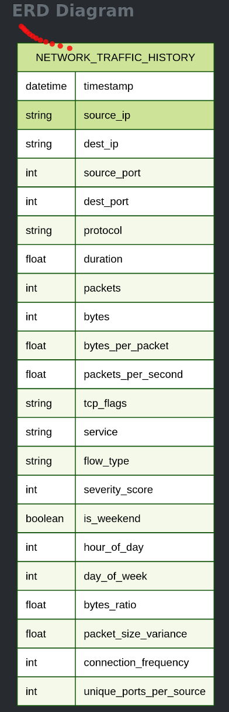

Phishing Detection

    Pattern: Deceptive web traffic and email-related connections
    Key Features: Connections to suspicious domains, specific payload patterns, timing correlation with email
    Example Signature: HTTP requests to newly registered domains with credential submission patterns
    Detection Approach: Domain reputation analysis and behavioral correlation
    Suggested Model Type: Classification model with domain features and timing analysis

Insider Threat Detection

    Pattern: Unusual behavior from internal users/systems
    Key Features: Off-hours access, unusual data access patterns, privilege escalation indicators
    Example Signature: Internal user accessing 10x normal data volume at 3 AM
    Detection Approach: Behavioral baseline deviation analysis
    Suggested Model Type: User and Entity Behavior Analytics (UEBA) with statistical profiling

Zero-Day Exploit Detection

    Pattern: Previously unseen attack patterns exploiting unknown vulnerabilities
    Key Features: Novel traffic patterns, exploitation of specific services, payload anomalies
    Example Signature: Unusual protocol behavior or unexpected service responses
    Detection Approach: Unsupervised learning to identify novel patterns
    Suggested Model Type: Deep autoencoders for detecting unprecedented patterns

Advanced Persistent Threat (APT) Detection

    Pattern: Sophisticated, multi-stage attacks with low-and-slow approach
    Key Features: Subtle behavioral changes, long-term pattern evolution, multi-vector coordination
    Example Signature: Gradual increase in data access combined with new external connections over weeks
    Detection Approach: Long-term behavioral analysis and correlation across multiple indicators
    Suggested Model Type: Ensemble of temporal models with long-term memory (LSTM networks)

Phishing 	    Classification 	Random Forest + domain features
Insider Threat 	Profiling 	    UEBA with statistical baselines
Zero Day 	    Unsupervised 	Deep autoencoders
APT 	        Multi-temporal 	LSTM networks + ensemble methods

Describe Table:

column_name	            data_type	                is_nullable	column_default
timestamp	            timestamp without time zone	YES	        None
source_ip	            character varying	        YES	        None
dest_ip	                character varying	        YES	        None
source_port	            integer	                    YES	        None
dest_port	            integer	                    YES	        None
protocol	            character varying	        YES	        None
duration	            double precision	        YES	        None
packets	                integer	                    YES	        None
bytes	                integer	                    YES	        None
bytes_per_packet	    double precision	        YES	        None
packets_per_second	    double precision	        YES	        None
tcp_flags	            character varying	        YES	        None
service	                character varying	        YES	        None
attack_state	        character varying	        YES	        None
severity_score	        integer	                    YES	        None
is_weekend	            character varying	        YES	        None
hour_of_day	            integer	                    YES	        None
day_of_week	            integer	                    YES	        None
bytes_ratio	            double precision	        YES	        None
packet_size_variance	double precision	        YES	        None
connection_frequency	integer	                    YES	        None
unique_ports_per_source	integer	                    YES	        None

A Random sample of the table, 10 entries of 5 million:

timestamp	source_ip	dest_ip	source_port	dest_port	protocol	duration	packets	bytes	bytes_per_packet	packets_per_second	tcp_flags	service	attack_state	severity_score	is_weekend	hour_of_day	day_of_week	bytes_ratio	packet_size_variance	connection_frequency	unique_ports_per_source
2025-05-23 03:03:58	222.187.194.161	172.16.173.30	50397	25	TCP	17.284574874714153	53	37361	704.9245283018868	3.0663178229239785	ACK	SMTP	Normal	1	False	3	4	2.161522644948354	0.0	1	1
2025-05-14 09:24:43	10.34.77.184	192.168.85.208	3239	53	TCP	2.832411544519312	49	31285	638.469387755102	17.2997458984428	SYN	DNS	Normal	1	False	9	2	11.045358172097611	0.0	1	1
2025-05-11 10:42:51	172.16.150.151	192.168.91.148	4016	1433	TCP	93.79683947561767	51	26557	520.7254901960785	0.5437283418622795	PSH	MSSQL	Normal	1	True	10	6	0.2831332073497364	0.0	1	1
2025-05-06 06:49:38	192.168.96.60	192.168.118.174	62870	80	UDP	7.888268942464821	51	50217	984.6470588235294	6.465296806179151	FIN	HTTP	Normal	1	False	6	1	6.36603548462546	207.5343167718111	1	6
2025-05-04 13:51:23	10.32.34.46	10.123.49.250	39307	22	ICMP	20.526470735392955	48	28937	602.8541666666666	2.3384438863732946	RST	SSH	Normal	1	True	13	6	1.409740640416334	0.0	1	1
2025-05-22 15:49:21	10.40.207.223	192.168.163.0	46980	3389	ICMP	15.775183667737508	70	40758	582.2571428571429	4.437349286979139	SYN	RDP	Normal	1	False	15	3	2.5836783176956537	0.0	1	1
2025-05-27 03:43:32	192.168.223.204	192.168.108.79	16919	25	TCP	15.935721169196285	35	33620	960.5714285714286	2.196323569444408	SYN	SMTP	Normal	1	False	3	1	2.1097256687063144	179.32684983876445	1	6
2025-05-26 18:37:18	172.22.68.23	10.244.158.13	61446	53	UDP	28.903425569624392	46	36653	796.804347826087	1.5915068575242854	URG	DNS	Normal	1	False	18	0	1.2681195836703834	91.74184802236736	1	3
2025-05-26 18:35:43	107.52.134.80	192.168.88.56	13639	25	UDP	6.672295259119774	50	19513	390.26	7.4936731751580385	ACK	SMTP	Normal	1	False	18	0	2.924480893337176	0.0	1	1
2025-05-17 02:01:59	192.168.181.77	192.168.106.124	20865	5432	UDP	2.236090949152767	41	30549	745.0975609756098	18.335569049878988	RST	PostgreSQL	Normal	1	True	2	5	13.661787778164712	157.75436182162423	1	10